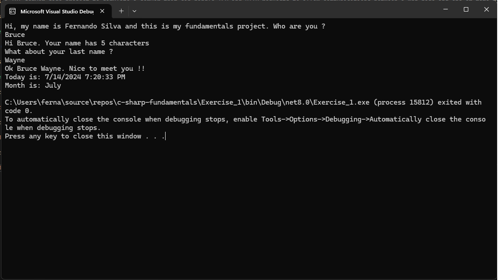
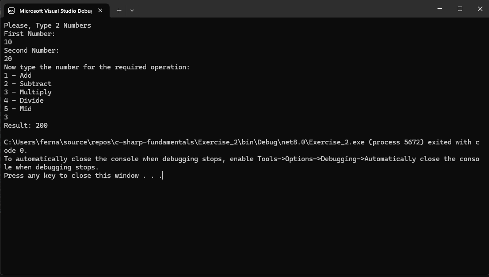
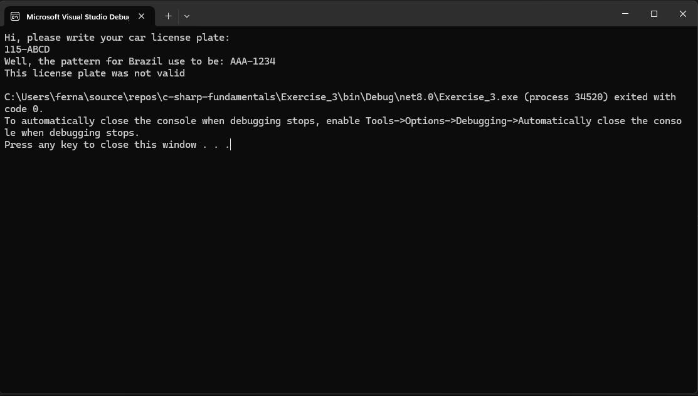

# C# Fundamentals Project

This is a C# Fundamentals project to practice some OOP Concepts.

# Concepts and C# Fundamentals

- OOP: Objects and Classes.

- Access Modifiers: Public, Private, Static and Protected.

# Project Images

- Exercise 1 - Welcome User

- Exercise 2 - Calculator

- Exercise 3 - Brazillian Car Plate Validator

